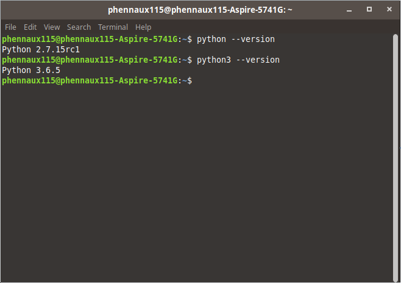

# Workshop Python3

In this workshop my goal is teach a bit about Python3.

<details>

<summary>Installation</summary>

**What do I need to start using Python?**

First we need an IDE (Atom, VSCode, Sublime Text, PyCharm, etc...) and Python installed on your machine.

**How do I check if Python is installed?**

**Linux**
For Linux users, don't worry Python2 and Python3 are installed, the command to check if Python is installed on Linux is this one(Look at the terminal screenshot)



**Windows**
For Windows users, Python isn't installed by default, so be sure to get the
[installer from python.org](https://www.python.org/downloads/)

**Mac**
For Mac users, you will have Python2 pre-installed, but here we need Python3. Follow [this link](http://docs.python-guide.org/en/latest/starting/install3/osx/) to install Python3 on your machine.

**Can I start coding Python?**

Well you could yes, but It's better to install some extensions on our IDE (VSCode for me, Atom works too).

**Extensions VSCode**
VSCode extensions to install:

- [Python extension from Microsoft](https://marketplace.visualstudio.com/items?itemName=ms-python.python)
- [Python extension pack](https://marketplace.visualstudio.com/items?itemName=fabioz.vscode-pydev)

**Extensions Atom**
Atom extensions to install:

- [linter-flake8](https://atom.io/packages/linter-flake8)
- [linter-pydocstyle](https://atom.io/packages/linter-pydocstyle)
- [script](https://atom.io/packages/script)

One we have the extensions installed, let's install the pip3, Python3's package manager where we will install pylint.
Why we need pylint? Well our IDE is great, but we can also code directly on a terminal and thanks to pylint we'll know what's wrong.

**Install pip3**
Here we will install pip3 in order to after instal pylint and get ready for start to code in Python3.

**Linux**
Run this command to install pip3 on linux.
<pre>sudo apt-get -y install python3-pip</pre>

**Windows**
On Windows is different, follow this tutorial.
[How to install pip3 on windows](https://matthewhorne.me/how-to-install-python-and-pip-on-windows-10/)

**Mac**
On Mac it's different too, follow this tutorial.
[How to install pip on Mac](https://itsevans.com/install-pip-osx/)


Once our pip3 is installed, we can install pylint.

**Linux**
Use this command<pre>sudo pip3 install pylint</pre>

**Windows**<br>
Use this command<pre>C:\Program Files\Python36\python" -m pip install pylint</pre>

**Mac**
Use this command<pre>sudo easy_install pip</pre>

And now we are ready to start coding with Python3.

</details>


<details>

<summary>Get started with Python3</summary>

**Python Basics**
Here we will learn some basics of Python.

    Lists
    Tuples
    Functions and Isinstance
    Classes
    String substitution and string formatting

</details>

<details>

<summary>Cool things we can do with Python3
</summary>

Allright now that you know how classes, functions and string subsitution works. Let's make a function to send emails, to different persons and in general it's like a

``` php
mailto();
```

function in PHP.

</details>